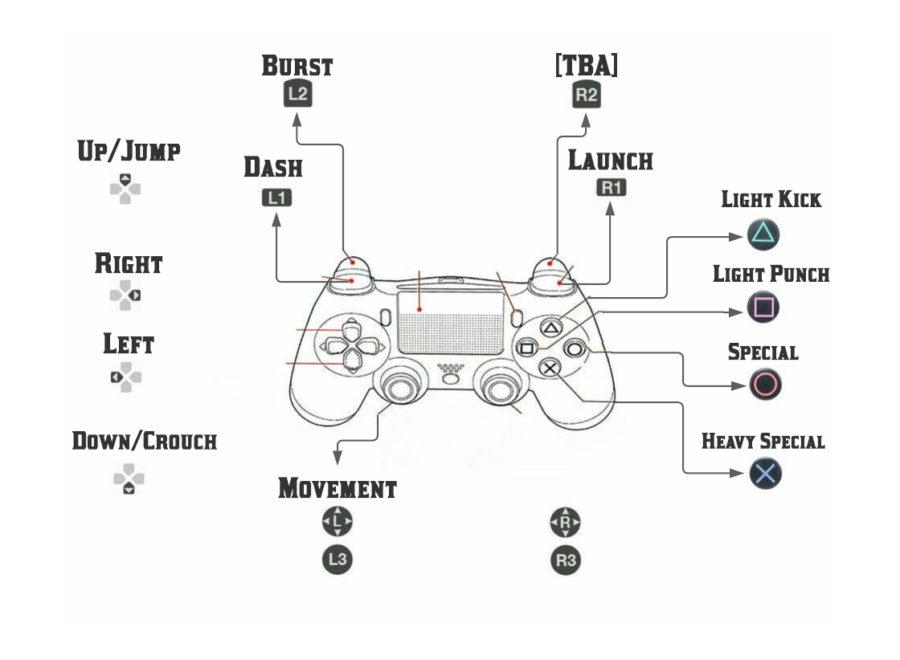
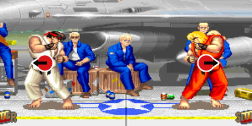

# **Wrathskeller Controls/Mechanics**

## Controls 
Below is an image of a possible configuration of the controls for the game, as the primary goal is to be able to play this game with a controller. Note that the R2 button is currently empty. It can correlate to another game mechanic in the future. This current scheme introduces 3 universal mechanics that every character can do in the game, using the bumper and trigger buttons (L/R buttons). 

 

*[Original Unedited Diagram](https://www.reddit.com/r/PS4/comments/ma2v4q/a_blank_ps4_controller_guide_i_made_i_was_not/)

## Movement
Players can move with either the D-Pad or the left joystick. Wrathskeller is a fighting game, so jumping and crouching are core parts of the game. Pressing "up" on the D-Pad, or moving the left joystick upwards, makes your character jump. You can control the direction of your jump, where you can either jump forwards or jump backwards.
Pressing "down" on the D-Pad, or moving the left joystick downwards, makes your character crouch. The importance of crouching is explained in this next section. 

 # **Main Attack Buttons**
 A player's primary method of fighting against their opponent is to use the main 4 buttons of the controller. 2 buttons belong to the moveset of a player's **Minor**, while the other 2 buttons correlate to moves belonging to a player's **Major**. For this configuration, the "Light Punch" and "Light Kick" are determined by a character's Minor. "Special" and "Heavy Special" are determined by a character's Major.  
 
# **Basic Fighting Game Mechanics**
Before going into the unique mechanics shown in the controls, we will explain basic mechanics found in all fighting games. 

## Blocking 
In fighting games, you block by **moving in the opposite direction of your opponent**. For instance, if your character is on the left side, and your opponent is on the right, you can block your opponent's attacks by either holding "left" on the D-Pad, or moving your left joystick to the left. This is called **Stand Blocking**. 
Note that you can block while in the air and while you are crouching. You can **Crouch Block** by holding a direction that's opposite your opponent, **pointing diagonally downwards**. If you are on the left side, you would hold both "left" and "down" on the D-Pad simultaneously. If you are on the right side, you would hold "right" and "down" simultaneously.

 

## Lows
You can still hit your opponent while they are stand blocking by using **low attacks**. These attacks are aimed towards the opponent's legs, thereby allowing you to hit your opponent while they are moving in the opposite direction. Most low attacks are attacks done while crouching. Every character has a universal set of inputs for crouch attacks. A list of command inputs for doing low attacks can be found in the **Player Moveset**.
 
 ## Trips
 One of themost important attacks that low blocks are meant to defend from are **trips**. Trips are low attacks that make opponent fall on the floor, and stay down for a small period of time. This gives you an advantage by giving you time to set up your next attack. For Wrathskeller, trips are done by **crouching and pressing R1**: 
 
 
  
 
 
 ## Overheads
 Crouch blocking can block the same attacks as normal blocks, and they block trips. So how do you prevent your opponent from crouch blocking all the time? The answer is **overheads**. While overheads can be blocked normally, they cannot be blocked by **crouch blocking**. Use overheads when your opponent is crouch blocking too often, and exploit your opponent's repetitive habit.  
 
 # **Unique Buttons**
 Now that we've gone through the base 4 attack buttons and universal fighting game mechanics, we will now go through the rest of the buttons, each corresponding to a unique mechanic in Wrathskeller. 
 
  ## Dash
  Every character will be able to run or dash, meaning they will move faster towards the opponent. There will be two methods in which this can be done. One method is to **double tap** the directional button. For instance, if you are playing on the right, you would press the "left" D-pad button twice rapidly, holding the button down for the second press. The other method would be to **hold the L1 button**, and release when you want your character to stop running. 
  
   ## Launch 
   As I mentioned before, every character will have a "trip" that downs their opponent for a few seconds. This is done by crouching and pressing R1. While your character isn't crouching, pressing R1 would commence your Launch attack. Launches are **universal overheads**, meaning every character can use Launch as an overhead. The attack will have a **long startup**, possibly around 1.5 seconds. The main purpose of a Launch is an attack that's easier to react to than most attacks, but if it lands, it punishes your opponent for getting hit. That way, every character has an equal opportunity to exploit their opponent if they are crouch blocking too much. After landing a Launch, your opponent will get launched into the air with **increased air time**. Your opponent will **take increased damage** while they are in this **"launched state"**, giving you a reward by allowing you to deal free additional damage by doing a combo against your opponent in the air.   
   
   ## Burst 
   Every character will also have a Burst mechanic, which is essentially their "get out of jail for free" card. It will be **managed by a separate bar**, a Burst bar. When the Burst bar is full, if you press L2 **while you are in a combo** or you are getting hit, **your opponent will be launched towards the other side of the screen**. The Burst bar fills up slowly, and it fills up as you get hit and take damage. 
   You cannot use Bursts if your character gets hit by a **Super**. Use Bursts wisely if you think you are in a sticky situation.
 
 # **Supers**
 "Supers" are devastating ultimate attacks that are unleashed via a specific input and sufficient bar resources. Supers are managed by a **"Super Bar"**, which increases as you land hits, block, or get hit. These Supers are different depending on your character's Major and Minor. The Super Bar is separated into two halves. Major Supers require the entire bar to be full, while Minor Supers can be done with half a Super Bar. 
 Every Major includes 1 Super, while every Minor has 2 Supers. If your character has a Major and Minor, they would have **1 Major Super**, and **2 Minor Supers**. 
 If your character is a **Dual Major**, you would have access to two Major Supers. However, you will **have no Minor Supers**. Furthermore, **your Super Bar would progress at a slower rate**. 
 
 