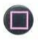
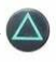
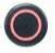
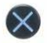
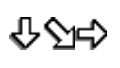
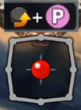
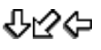
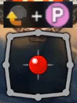

# **Player Moveset**
These are moves that every character in the game can perform.  
**Attack Type** classifies whether the move is a low or overhead. If its **blank**, then it can be blocked with either a Standing Block or Crouch Block. Refer to the Wrathskeller Controls/Mechanics Guide if either of those terms are unfamiliar. 
Note that certain Majors and Minors can be unique in that certain moves differ in their Attack Type. However, this moveset applies to most Majors/Minors in the game. 
For the Supers, the number of Supers a character has depends on whether they are a Dual Major or not. However, **every Major has 1 Super** while **every Minor has 2 Supers**. Note that the Major Supers are numbered 1 and 2. These numbers are only applicable to Dual Major characters. Otherwise, **every character with a Major and Minor will use the Major Super 1 input**. They would also have access to both Minor Super 1 and Minor Super 2. 
GIFS are provided for the motions to perform Supers. Ignore the pink "P" symbol in them, and replace it with the proper button for the input. 

| Move | Input | Attack Type |
| ----------- | ----------- | ---------|
| Light Punch |  |          |
| Light Kick  |  |          |
| Special |  | |
| Heavy Special |  | |
| Crouching Light Punch |  | Low |
| Crouching Light Kick |   | Low |
| Crouching Special |  |  |
| Crouching Heavy Special|  | |
| Jumping Light Punch |  | |
| Jumping Light Kick |  | |
| Jumping Special |  | Overhead|
| Jumping Heavy Special |  | Overhead|
| Launch |  | Overhead |
| Major Super 1 |    | |
| Major Super 2 |    | |
| Minor Super 1 |    | |
| Minor Super 2 |    | |

 
 